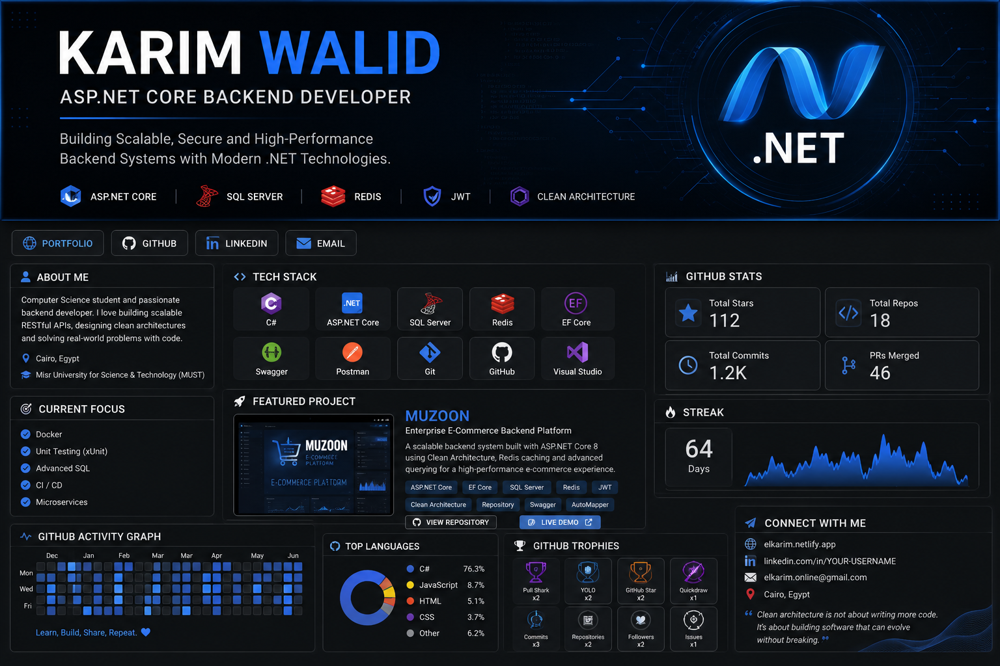

# 👋 Karim Walid Hamed

<h3 align="center">
ASP.NET Core Backend Developer
</h3>

Building scalable REST APIs using modern .NET technologies.

## 🚀 About Me

ASP.NET Core Backend Developer passionate about building clean, scalable, and maintainable backend systems.

**Tech Stack:**

C# • ASP.NET Core Web API • Entity Framework Core • LINQ • SQL Server • Redis • REST APIs • JWT • Swagger • Git

**Architecture & Patterns:**

Onion Architecture • SOLID Principles • Repository Pattern • Unit Of Work • Specification Pattern

## 📌 Featured Project

### 🛒 Muzoon - Enterprise E-Commerce API

A scalable E-Commerce backend built with **ASP.NET Core 8** following clean architecture principles.

**Features:**

- JWT Authentication & Authorization
- ASP.NET Identity
- Redis Caching & Basket Storage
- Repository & Unit Of Work Pattern
- Specification Pattern
- Global Exception Handling Middleware
- Pagination, Filtering & Sorting
- Swagger API Documentation

## 🎓 Education

**B.Sc. Computer Science**  
Misr University for Science and Technology (MUST)
Expected Graduation: **2028** 

## 📫 Contact

📧 elkarim.online@gmail.com  
🌐 https://bnkarim.vercel.app  
💼 LinkedIn: https://www.linkedin.com/in/elkariem  
🐙 GitHub: https://github.com/elkariem

⭐ Always learning and building better backend solutions.
